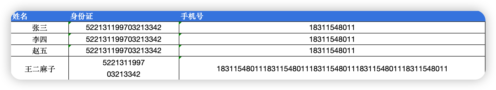

# 简单 Excel 导入导出工具库

🌈 简单使用， 方便快捷。 支持 `xls` `xlsx` `csv` 🌸



## 🎉 使用方法

环境要求
- PHP >= 7.3
- PhpSpreadsheet >= 1.23

安装

```bash
$ composer require yuxiaobo/simple-excel
```

导入

```php
$arr = SimpleExcel::import(dirname(__DIR__) . '/test/test.xlsx', 'xlsx', array(
    '姓名'      => 'name',
    '年龄'      => 'age',
    '性别'      => 'gender'
));
var_dump($arr);
```

导出到文件

```php
SimpleExcel::export('/tmp/dump.xlsx', 'xlsx', [
    'name'      => '姓名',
    'idcard'    => '身份证',
    'mobile'    => '手机号'
], [
    ['name' => '张三', 'idcard' => '522131199703213342', 'mobile'=>'18311548011'],
    ['name' => '李四', 'idcard' => '522131199703213342', 'mobile' => '18311548011'],
    ['name' => '赵五', 'idcard' => '522131199703213342', 'mobile' => '18311548011'],
],'#ff0000', '#00ff00', '#333333');
```

导出并下载数据

```php
SimpleExcel::setDownloadHeader('导出数据.xlsx'); // 设置下载文件响应头
SimpleExcel::export('php://output', 'xlsx', [
    'name'      => '姓名',
    'idcard'    => '身份证',
    'mobile'    => '手机号'
], [
    ['name' => '张三', 'idcard' => '522131199703213342', 'mobile'=>'18311548011'],
    ['name' => '李四', 'idcard' => '522131199703213342', 'mobile' => '18311548011'],
    ['name' => '赵五', 'idcard' => '522131199703213342', 'mobile' => '18311548011'],
],'#ff0000', '#00ff00', '#333333');
```

性能测试

1. 此库的 `xls/xlsx` 基于的 `PhpSpreadsheet` 实现，且导出表格有着色处理。建议5w行100列以内的数据处理
2. CSV单独做了优化处理, 100000行100列导入导出测试结果如下
    - export: `0.9 sec, 1.6 gb`
    - import: `3.92 sec, 1.6gb`

## ✅️ 常见问题

**1. 导入或导出几十万条数据失败**

- ① 游标分批查询数据导出
- ② 数据量较大建议做成异步队列，避免影响主业务
- ③ 少用模型，多用大 DB 查数据（以 thinkphp为例）能明显优化内存与任务耗时
- ④ 只查询需要的字段
- ⑤ 耗时任务强烈建议做成异步队列的方式！！！不要犟，避免影响主业务

**2. 内存超出使用限制**

`Allowed memory size of 8388608 bytes exhausted (tried to allocate 1298358 bytes)`

上述问题是由于内存不足导致的，可能是有死循环，或者代码对内存的使用量比较大。


临时解决办法：`ini_set('memory_limit', '256M');`


**3. 请求超时**

临时解决：`ini_set('max_execution_time', 600);`

> Tips: 也需要注意一下 nginx 的最大保持 http 请求时间


其他优化办法:

- (1). 可以临时通过增加 php 执行时间解决 `ini_set('max_execution_time', 600);`
- (2). 忘记说了，也需要对应增加 nginx/apache 的 http 请求保持时间，它在你的上层～
- (3). 耗时任务强烈建议做成异步队列的方式！！！不要犟，避免影响主业务

**4. 数字太长变成 E+**

~~导出时在前面加个单元号或者反单元号，如身份证：`522131199703253412` 改成 `'522131199703253412`~~

> `0.1.3起` 导出单元格数据强制转换字符串，避免出现科学计算法

**5. 大数据导出**

> 建议: 使用 csv 替代 xlsx，`xls 最大行 65536，xlsx 最大行 1048576（一百万）`, csv 没有限制

- ① 本库的 csv 做过优化，[100 000 rows and 100 columns测试](#性能测试) 基本足够大部分使用场景了
- ② 如果你对内存和速度有更高的追求，我这边有几个推荐。
  - 1. 直接用 php 的 `fputcsv` 和 `fgetcsv`，使用 chunk 分批查询（如果你的框架支持）
  - 2. 使用 PHP 扩展 [xlswriter](https://xlswriter-docs.viest.me/zh-cn) [(感谢 @bugsnail @langziyang @QlanQ 推荐)](https://www.v2ex.com/t/1045263#reply5)
- ③ 导出几百万上千万的数据，怎么打开？用 `UltraEdit` 即可，很🐂🍺的

**6. 空行忽略**

遇到空行数据默认是跳过的

可以通过 simpleExcel::import() 函数的参数4 `ignoreEmptyRow` 设置

## 💡意见反馈

如果您在使用过程中遇到了问题，请先反馈 issue

着急使用的话请联系 绿泡泡：Base1024

或是 `fork` 一份自己改，项目遵循 MIT 开源协议

请务必反馈 issue
